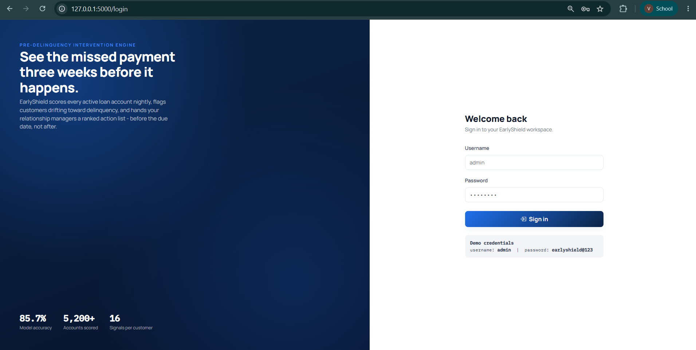
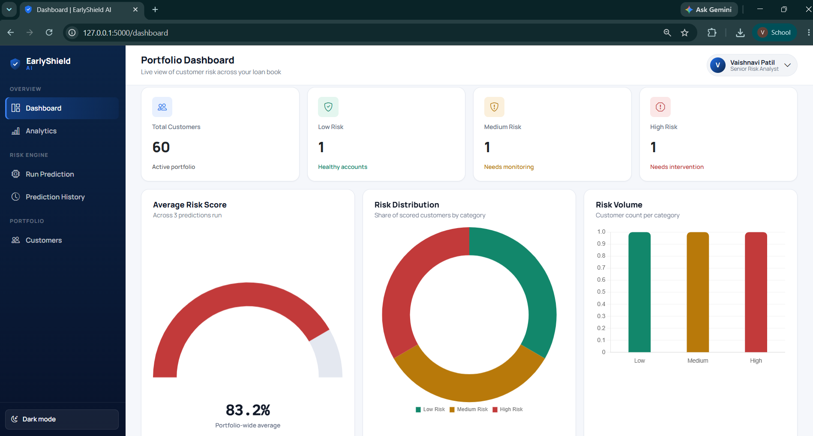
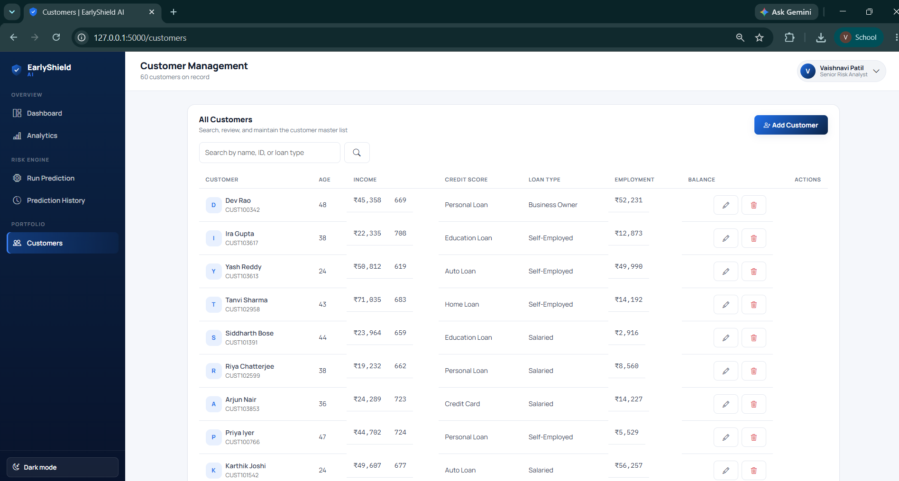
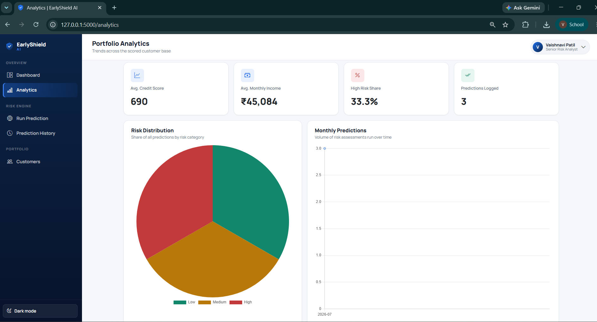

# EarlyShield AI — Pre-Delinquency Intervention Engine

EarlyShield AI is a risk-scoring platform that flags retail-banking customers likely
to miss an EMI payment *before* it happens, and pairs every prediction with a
plain-English explanation and a suggested intervention. It's built as an
internship-grade MVP: a trained classifier behind a Flask API, a SQLite-backed
customer/prediction store, and a dashboard a risk-operations team could actually use.

## Overview

Most collections workflows are reactive — a customer is contacted only after they've
already missed a due date. EarlyShield inverts that: it scores customers on 16
financial and behavioral signals (EMI ratio, credit utilization, salary delay
patterns, payment history, and more) and classifies each one as **Low**, **Medium**,
or **High** risk of near-term delinquency, ahead of the miss.

Every prediction ships with:
- A risk probability and confidence score
- The top contributing factors, in underwriter-readable language (not raw SHAP values)
- A prioritized list of recommended interventions (EMI restructuring, SMS reminder,
  relationship-manager assignment, etc.)

## Features

- **Authenticated workspace** — session-based login, no anonymous access to customer data
- **Dashboard** — portfolio-wide stat cards, a risk-distribution donut, a volume bar
  chart, and a live "recent predictions" feed
- **Customer management** — full CRUD with search and pagination over a customer
  master table
- **Risk prediction** — a 16-field intake form, scored live against the trained model
  via `/api/predict`
- **Explainable AI** — rule-based, threshold-driven factor extraction so every flag
  traces back to a specific number in the customer's profile
- **Recommended interventions** — maps risk category + active factors to concrete
  next actions with priority labels
- **Prediction history** — every scored customer logged to SQLite, searchable,
  deletable, exportable to CSV, and downloadable as a one-page PDF report
- **Analytics** — risk distribution, monthly prediction volume, average credit score
  and income, and high-risk share
- **Dark mode**, animated result reveal, and a loading state on the prediction call

## Screenshots

### Login


### Dashboard


### Customers


### Prediction Result 1
.png)

### Prediction Result 2
.png)

### Analytics


## Technology Used

| Layer | Tech |
|---|---|
| Backend | Python 3.12, Flask |
| Machine Learning | XGBoost (falls back to Random Forest if unavailable), scikit-learn |
| Data | pandas, NumPy |
| Persistence | SQLite (stdlib `sqlite3`) |
| Frontend | Bootstrap 5, vanilla JavaScript, Chart.js |
| Reporting | ReportLab (PDF generation) |
| Model serialization | joblib |

## Installation

```bash
# 1. Clone the repository
git clone https://github.com/<your-username>/earlyshield-ai.git
cd earlyshield-ai

# 2. Create and activate a virtual environment
python3 -m venv venv
source venv/bin/activate          # Windows: venv\Scripts\activate

# 3. Install dependencies
pip install -r requirements.txt

# 4. (Optional) Regenerate the dataset and retrain the model
#    A trained model + dataset already ship in the repo, so this step
#    is only needed if you want to regenerate them from scratch.
python dataset/generate_dataset.py
python train_model.py

# 5. Run the application
python app.py
```

The app starts at **http://127.0.0.1:5000**.

### Demo login

```
username: admin
password: earlyshield@123
```

## Usage

1. Sign in with the demo credentials above.
2. The **Dashboard** shows portfolio-wide risk stats (empty until you run your
   first prediction).
3. Go to **Run Prediction**, fill in a customer's financial profile, and click
   **Predict Risk**. The result panel updates in place with the risk gauge,
   contributing factors, and recommended actions.
4. Every prediction is saved automatically — view it under **Prediction History**,
   export the full log to CSV, or download a single customer's result as a PDF.
5. Manage the underlying customer records under **Customers** (add, edit, delete,
   search).
6. **Analytics** aggregates trends across everything scored so far.

## Folder Structure

```
earlyshield-ai/
├── app.py                      # Flask application & routes
├── database.py                 # SQLite data-access layer
├── train_model.py              # Model training & evaluation pipeline
├── requirements.txt
├── .gitignore
├── README.md
│
├── dataset/
│   ├── generate_dataset.py     # Synthetic banking dataset generator
│   └── customer_banking_data.csv
│
├── models/
│   ├── risk_model.pkl          # Trained model + encoders (joblib bundle)
│   └── model_metadata.json     # Accuracy / precision / recall / F1 / confusion matrix
│
├── database/
│   └── earlyshield.db          # Created automatically on first run
│
├── utils/
│   ├── explainability.py       # Rule-based contributing-factor extraction
│   └── recommendations.py      # Risk → intervention mapping
│
├── templates/                  # Jinja2 templates (login, dashboard, customers, ...)
│
└── static/
    ├── css/style.css
    ├── js/                     # app.js, charts.js, predict.js
    └── images/
```

## Model

- **Algorithm:** XGBoost multi-class classifier (`multi:softprob`), 260 trees,
  max depth 5. Falls back to a balanced Random Forest if xgboost isn't
  installed in the target environment.
- **Features:** 18 engineered features per customer (raw fields + encoded
  categoricals + derived ratios like `Savings_To_Income` and
  `Disposable_Income`).
- **Evaluation** (see `models/model_metadata.json` for the exact numbers from
  the last training run): weighted accuracy, precision, recall, F1, and a
  full confusion matrix are printed by `train_model.py` and persisted to disk.
- **Explainability:** rather than a SHAP dependency, contributing factors are
  computed against fixed underwriting thresholds (EMI ratio, utilization,
  credit score, salary delay, late-payment count). This keeps the reasoning
  legible to a non-technical relationship manager and avoids a heavyweight
  dependency for an MVP.

## Future Scope

- Swap the rule-based explainability layer for SHAP values once the model
  is retrained on real (not synthetic) portfolio data
- Add role-based access control (Analyst vs Manager vs Admin)
- Batch scoring endpoint for nightly portfolio-wide re-scoring
- Webhook/SMS integration so "Send SMS Reminder" actually fires a message
- Model monitoring dashboard (drift detection, feature distribution over time)
- Swap SQLite for PostgreSQL for multi-user production deployment

## License

Built as an educational / portfolio project. Not affiliated with any real
financial institution; the dataset is entirely synthetic.
